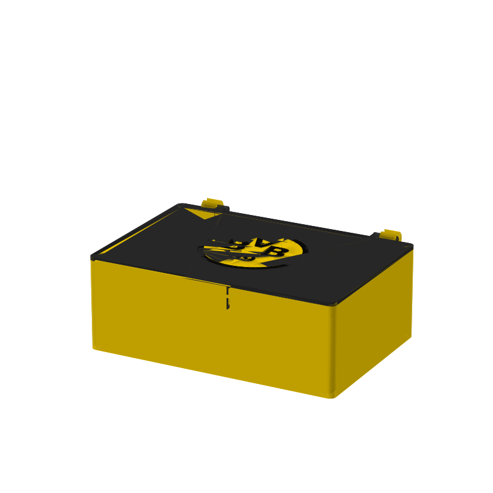
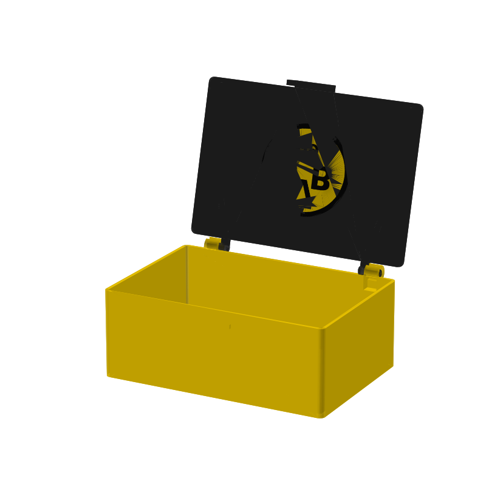
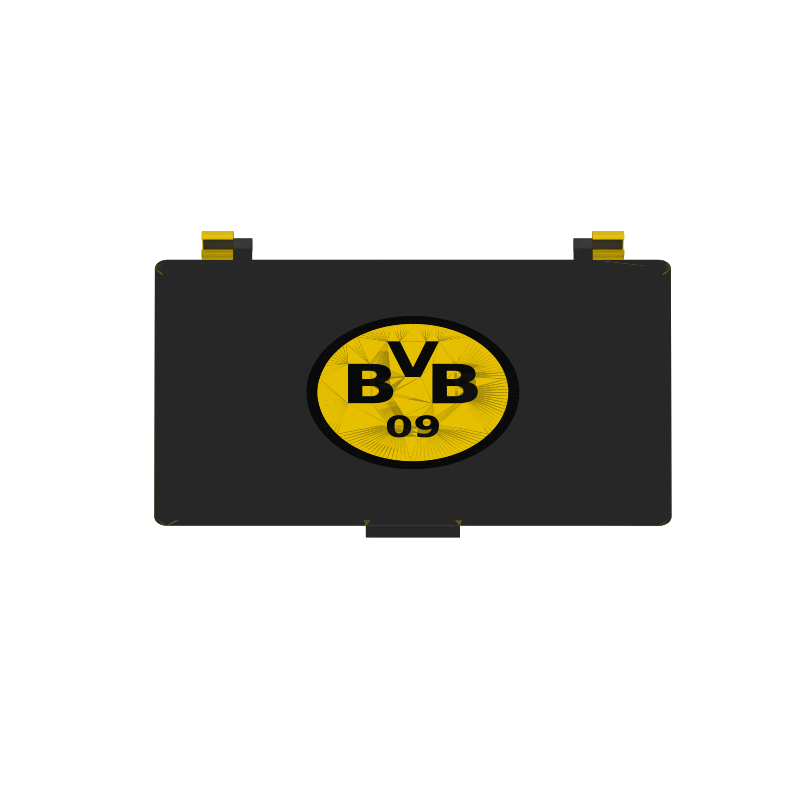

# Butterbrotdose mit BVB-Emblem & Klappdeckel 🟡⚫

Parametrisches 3D-Modell einer **Schüler-Brotdose** (für 1–2 belegte Brote +
etwas Obst) mit stilisiertem **„BVB 09"-Emblem** und **hinten angeschlagenem
Klappdeckel** – ausgelegt für den **Bambu Lab A1 Mini** (Bauraum 180 × 180 ×
180 mm).

| Geschlossen | Geöffnet | Logo (Draufsicht) |
|---|---|---|
|  |  |  |

> Die 3D-Bilder sind einfache matplotlib-Vorschauen (kein Foto-Render); die
> tatsächliche Druckqualität ist deutlich sauberer.

## Mechanik

- **Scharnier (Einrast-Zapfen):** Am Deckel sitzen zwei seitliche Zapfen, die
  in offene C-Clips hinten an der Box **von oben einrasten**. Die Clip-Mäuler
  sind enger als der Zapfen (Schnappsitz) → der Deckel hält sicher und geht
  nur durch **bewusstes, kräftiges Hochziehen** wieder ab (Verlustsicherung).
- **Frontverschluss (Schnapphaken):** Vorne greift ein Haken am Deckel unter
  eine Nase an der Box und hält den Deckel zu. Zum Öffnen die Vorderkante
  anheben.
- Der Deckel klappt **nach hinten auf** (geprüft kollisionsfrei bis ~120°).

## Teile

| Teil | Datei |
|------|-------|
| Behälter (mit Scharnier-Clips + Verschlussnase) | `output/butterdose_box.stl` / `.step` |
| Klappdeckel (mit Zapfen + Fronthaken) | `output/butterdose_lid.stl` / `.step` |
| Logo-Hintergrund (gelb) | `output/butterdose_logo_bg.stl` |
| Logo-Vordergrund (schwarz) | `output/butterdose_logo_fg.stl` |

Außenmaße: Behälter ~165 × 118 × 65 mm, lichte Innenmaße ~160 × 113 × 63 mm.
Mit den Scharnier-Clips und der Verschlussnase ragt die Box hinten/vorne etwas
über; alle Teile bleiben unter 180 mm.

## Modell erzeugen / anpassen

```bash
pip install -r requirements.txt
python src/butterbrotdose.py
```

Alle Maße stehen als Variablen oben in
[`src/butterbrotdose.py`](src/butterbrotdose.py). Relevante Stellschrauben:

- Größe: `BOX_L`, `BOX_W`, `BOX_H`, `WALL`
- Scharnier: `HINGE_PIN_D`, `HINGE_CLEAR` (Spiel), `MOUTH_FACTOR`
  (Schnapp-/Haltekraft; kleiner = fester), `HINGE_INSET`
- Verschluss: `LATCH_W`, `HOOK_OVER` (Eingriff), `CATCH_Z`, `LATCH_CLEAR`
- Logo: `LOGO_R`, `FS_TOP`, `FS_V`, `V_RISE`, `LETTER_DX`

## Drucken auf dem A1 Mini

### Orientierung
Die STL-Dateien sind bereits **druckfertig orientiert**:
- **Behälter:** offene Seite nach oben – die Scharnier-Clips zeigen nach oben
  (Maul oben), die Verschlussnase nach vorne. Keine Stützen nötig.
- **Deckel:** Die Platte liegt mit der **Logo-Seite auf dem Druckbett** (glatte,
  kontrastreiche Oberfläche); Zapfen und Fronthaken zeigen nach oben. Der Export
  wendet den Deckel dafür automatisch. Das Logo ist deshalb intern gespiegelt –
  nach dem Druck liegt es seitenrichtig oben.
- ~165 mm lang → am besten **diagonal** platzieren, damit ein Brim passt.

### Empfohlene Slicer-Einstellungen (Bambu Studio / Orca)
- Schichthöhe **0,2 mm**, Wände **3**, Boden/Decke **4–5**, Infill **15 %**
- **Brim** (5 mm) für die großen flachen Teile
- Material: **PETG** (zäher/wärmestabiler als PLA und gutes Schnapp-Verhalten).
  ⚠️ FDM-Drucke gelten **nicht** als offiziell lebensmittelecht – Brot ggf. in
  Papier/Folie legen.

### Zweifarbiges Logo
`butterdose_lid.stl`, `butterdose_logo_bg.stl`, `butterdose_logo_fg.stl` in
Bambu Studio importieren → markieren → **„Assemble"**. Farben zuweisen:
`logo_bg` = Gelb, `logo_fg` = Schwarz (Deckel z. B. Schwarz). Mit AMS lite
automatischer Farbwechsel, sonst manueller Filamentwechsel (Pause).

### Zusammenbau
Deckel auflegen und die beiden Zapfen **von oben kräftig in die hinteren Clips
drücken**, bis sie hörbar einrasten. Vorne den Verschluss zudrücken.

> **Toleranz-Hinweis:** Scharnier-Schnappsitze reagieren empfindlich auf die
> Druckkalibrierung. Falls der Deckel zu fest/zu locker sitzt, `HINGE_CLEAR`
> bzw. `MOUTH_FACTOR` (Scharnier) oder `HOOK_OVER`/`LATCH_CLEAR` (Verschluss)
> anpassen und neu erzeugen. Ein kleiner Testdruck nur des Scharnierbereichs
> spart Material.

## Hinweis Markenrecht
Das „BVB 09"-Emblem ist hier **stilisiert nachempfunden** und nur für den
**privaten Gebrauch** gedacht. Das offizielle Logo ist eine eingetragene Marke
von Borussia Dortmund – kein Verkauf oder Vertrieb der Drucke.
