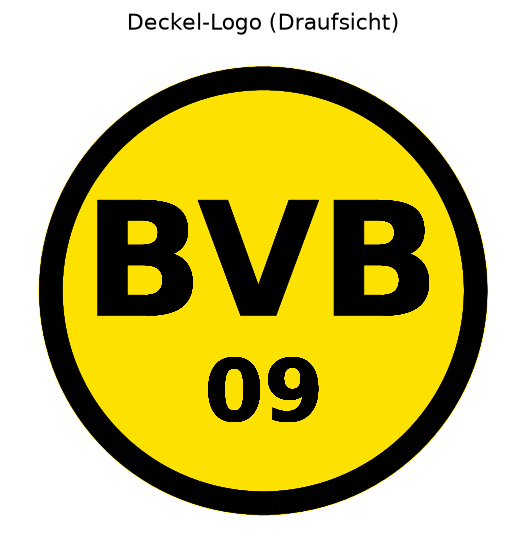

# Butterbrotdose mit BVB-Emblem 🟡⚫

Parametrisches 3D-Modell einer **Schüler-Brotdose** (für 1–2 belegte Brote +
etwas Obst) mit stilisiertem **„BVB 09"-Emblem** auf dem Deckel – ausgelegt für
den **Bambu Lab A1 Mini** (Bauraum 180 × 180 × 180 mm).



## Was wird erzeugt?

| Teil | Datei | Außenmaß (L × B × H) |
|------|-------|----------------------|
| Behälter | `output/butterdose_box.stl` / `.step` | 165 × 118 × 65 mm |
| Deckel (Übergreif-Kappe) | `output/butterdose_lid.stl` / `.step` | 170,6 × 123,6 × 16,4 mm |
| Logo-Hintergrund (gelb) | `output/butterdose_logo_bg.stl` | ⌀ 68 × 0,8 mm |
| Logo-Vordergrund (schwarz) | `output/butterdose_logo_fg.stl` | ⌀ 68 × 0,8 mm |

Der Deckel ist eine **Kappe, die außen über den Behälter greift** (Reibsitz,
0,4 mm Spiel je Seite). Das Logo sitzt als **flächenbündiges Zweifarb-Inlay** in
der Deckelplatte – die beiden Logo-Teile (gelb/schwarz) füllen eine Tasche im
Deckel passgenau und überlappungsfrei.

## Modell selbst erzeugen / anpassen

```bash
pip install -r requirements.txt
python src/butterbrotdose.py
```

Alle Maße stehen als Variablen oben in [`src/butterbrotdose.py`](src/butterbrotdose.py)
(`BOX_L`, `BOX_W`, `BOX_H`, `WALL`, `CLEAR`, Logo-Parameter …) und können frei
geändert werden. Die fertigen Dateien landen in `output/`.

## Drucken auf dem A1 Mini

### Orientierung (wichtig!)
Die STL-Dateien sind bereits **druckfertig orientiert**:
- **Behälter:** offene Seite nach **oben** – steht von selbst richtig, keine Stützen.
- **Deckel:** Platte liegt **flach auf dem Druckbett**, der Rand zeigt nach oben.
  Das Logo liegt damit auf der **bettzugewandten Seite** → wird besonders glatt.
- Beide Teile sind ~170 mm lang. Das ist nah am Limit des A1 Mini (180 mm) –
  am besten **diagonal auf der Platte** platzieren, damit ein Brim noch passt.

### Empfohlene Slicer-Einstellungen (Bambu Studio / Orca)
- Schichthöhe **0,2 mm**
- Wände/Perimeter **3**, Boden-/Deckenschichten **4–5**
- Infill **15 %** (Gyroid)
- **Brim** (5 mm) für gute Haftung bei den großen flachen Teilen
- Material: **PETG** empfohlen (robuster/wärmestabiler als PLA).
  ⚠️ Hinweis: FDM-Drucke gelten **nicht** als offiziell lebensmittelecht
  (Schichtrillen + Düsenmaterial). Für Lebensmittelkontakt ggf. lebensmittel-
  echtes Filament + Food-Safe-Versiegelung verwenden oder Brot in Papier/Folie
  einlegen.

### Zweifarbiges Logo (gelb/schwarz)
1. In Bambu Studio **alle drei Deckel-Dateien** importieren:
   `butterdose_lid.stl`, `butterdose_logo_bg.stl`, `butterdose_logo_fg.stl`.
2. Die drei Objekte markieren → Rechtsklick → **„Assemble"** (zu einem Objekt
   zusammenfügen). Sie sind koordinatengleich und rasten passgenau ein.
3. Farben zuweisen: Deckel = z. B. Schwarz, `logo_bg` = **Gelb**,
   `logo_fg` = **Schwarz**.
   - **Mit AMS lite:** automatischer Farbwechsel.
   - **Ohne AMS:** Bambu Studio fügt einen **manuellen Filamentwechsel**
     (Pause) ein – beim Aufruf das Filament tauschen.

Der Behälter wird einfarbig gedruckt (frei wählbar, z. B. Gelb oder Schwarz).

## Hinweis Markenrecht
Das „BVB 09"-Emblem ist hier **stilisiert nachempfunden** und nur für den
**privaten Gebrauch** gedacht. Das offizielle Logo ist eine eingetragene Marke
von Borussia Dortmund – kein Verkauf oder Vertrieb der Drucke.
